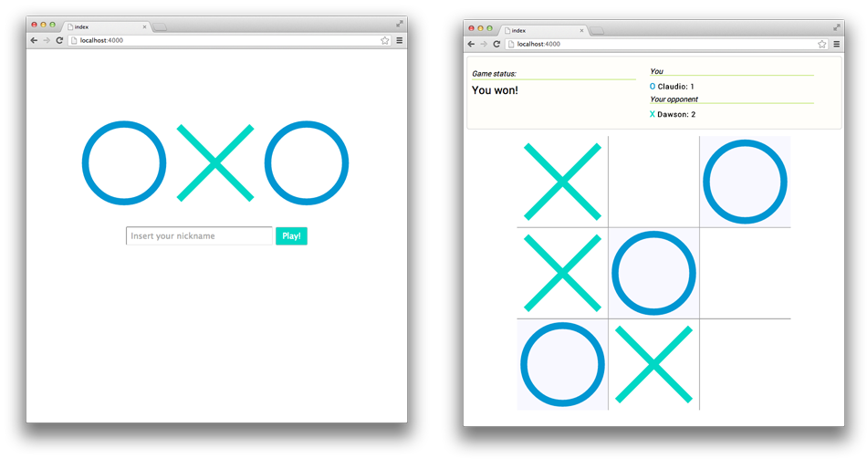

#Dart OXO
Dart implementation of the tic-tac-toe game, built as a sample application to show:

- **Web Sockets** 

- **client-server** interaction

- **DOM** manipulation

- other cool Dart features

## Usage

1. Install the dependencies:

		cd /path/to/dart_OXO/client
		pub install
		cd /path/to/dart_OXO/server
		pub install
		

2. Run the server on the host machine:

		cd /path/to/dart_OXO/server/bin
		dart server.dart

3. Open a browser at:
	
	
		http://localhost:4000 
		# or
		http://192.168.X.Y:4000
		

## Screenshots

## Author(s)
Claudio d'Angelis  
[claudiodangelis.com/+](http://claudiodangelis.com/+)
## License
_See LICENSE_